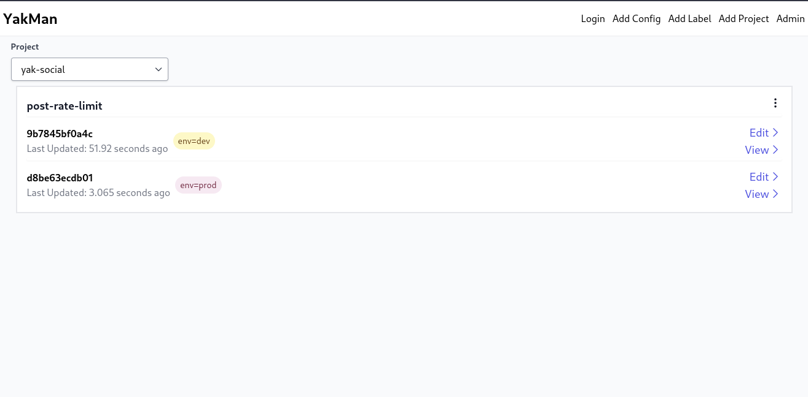

# YakMan Basics

**NOTE**: These docs are being very early in the projects life, so the UI in the screenshots provided is likely slightly different as the project UI improves. 

To use YakMan you will want to understand a few key concepts. 

- Configs
- Instances
- Revisions
- Projects
- Labels


#### Configs

In YakMan a config represents a single logically configuration for an application. 
A config should ideally be a small config that is targeted at a single use-case.
This probably seems a bit vague now, but it will become more clear as you continue reading.

#### Instances

A config can have multiple versions called instances. This can be use for supporting different config settings for environments, regions, ect.

#### Revisions

A revision is simply snapshot of an instance at a point in time (similiar to commits in Git). Revisions allow you to track the history of a config and easily revert to a previous revision.

#### Projects

A project is a grouping of configs. Projects can be used to group configs that a single service/team uses. Projects allow you to provide access control to only allow engineers to access the configs they need.


#### Labels

Labels are another organizational tool, they allow you to tag instances with a metadata to help keep track config instances.


To make explaining the concepts above, I will use the following social media example in this doc:

Lets say you are an engineer working on a socially application. In you app, you may want to rate limit how many times a user can post in a given period. You may want to configure the amount of posts and the period length. Lets say your application config looks like this:

```json
{
    "postLimit": 3,
    "periodInSeconds": 60
}
```




