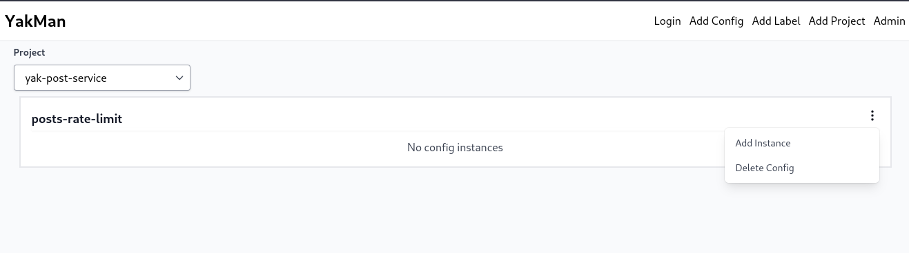
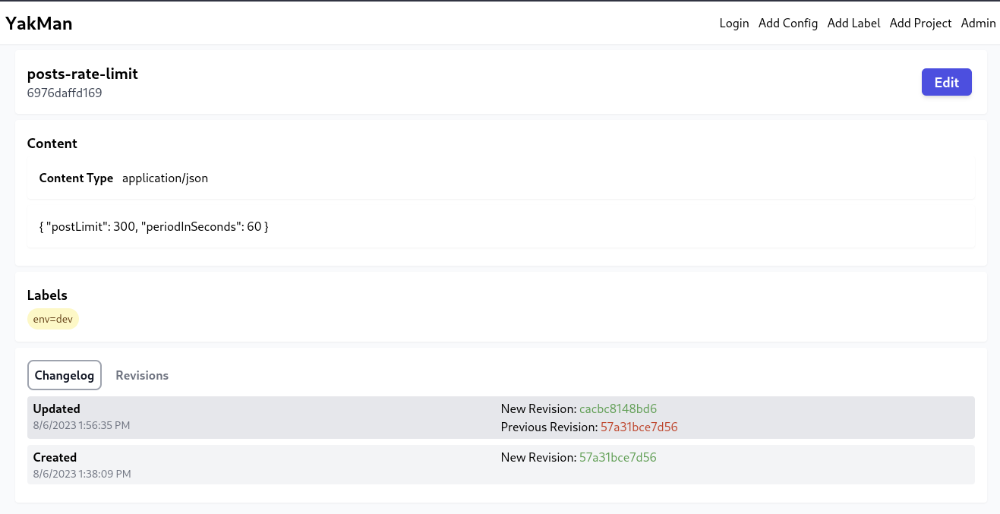

# YakMan Basics

**NOTE**: These docs are being very early in the projects life, so the UI in the screenshots provided is likely slightly different as the project UI improves. 

To use YakMan you will want to understand a few key concepts. 

- Configs
- Instances
- Revisions
- Projects
- Labels


#### Configs

In YakMan a config represents a single logically configuration for an application. 
A config should ideally be a small config that is targeted at a single use-case.
This probably seems a bit vague now, but it will become more clear as you continue reading.

#### Instances

A config can have multiple versions called instances. This can be use for supporting different config settings for environments, regions, ect.

#### Revisions

A revision is simply snapshot of an instance at a point in time (similiar to commits in Git). Revisions allow you to track the history of a config and easily revert to a previous revision.

#### Projects

A project is a grouping of configs. Projects can be used to group configs that a single service/team uses. Projects allow you to provide access control to only allow engineers to access the configs they need.


#### Labels

Labels are another organizational tool, they allow you to tag instances with a metadata to help keep track config instances.


## Real(ish) World Example

Lets say you are an engineer working on a social media application (Yak Social). In your app, you may want to rate limit how many times a user can post in a given period. You may want to configure the amount of posts and the period length. 
Also, you want to have different configs in each environment since your QA team has automated tests that fail with strict rate limiting.


Lets say your application has a posts microservice (`yak-post-service`) with a config looks like this:

```json
{
    "postLimit": 3,
    "periodInSeconds": 60
}
```


In YakMan we can create a new project called `yak-post-service`, that will contain the configs for this microservice. In this project, we will create a config called `posts-rate-limit` that will have 2 instances (one for prod and one for dev).

First lets create the `yak-post-service` project


Now that we have an empty project lets add an `env` label so that we can easily track which config belongs to each environment.  


Now lets create our `posts-rate-limit` config


Now we can finally create our config instances. Notice that we use the postLimit of 100 for dev




And that is it! We can now start using our config in our application.
Notice how YakMan created an ID for each instance (`88355e922571` and `6976daffd169`). 
We can use these IDs to reference each config using the YakMan API. 

Below is an example curl for each environment:

```sh
curl -H "Cookie: access_token=${YAKMAN_TOKEN}" ${YAKMAN_BASE_URL}/v1/configs/posts-rate-limit/instances/88355e922571/data
```

```json
{
    "postLimit": 3,
    "periodInSeconds": 60
}
```


```sh
curl -H "Cookie: access_token=${YAKMAN_TOKEN}" ${YAKMAN_BASE_URL}/v1/configs/posts-rate-limit/instances/6976daffd169/data
```

```json
{
    "postLimit": 100,
    "periodInSeconds": 60
}
```


Great, we can now use our configs in our application. Ideally, your application polls for config updates to avoid adding latency to our requests.

But, lets say that in our dev env 100 is not high enough and our QA tests are still having issues. Lets update our config in YakMan without modifying/redeploying our application.


If we click Edit on the `env=dev` instance we can update the postLimit to 300.


Before any changes are applied, we will need to get approval from an Admin or Approver for this project.


After approving, the config will be applied and if we rerun our curl from ealier we will see an updated value:


```sh
curl -H "Cookie: access_token=${YAKMAN_TOKEN}" ${YAKMAN_BASE_URL}/v1/configs/posts-rate-limit/instances/6976daffd169/data
```

```json
{
    "postLimit": 300,
    "periodInSeconds": 60
}
```

Finally, you can see the update history from the view instance page


